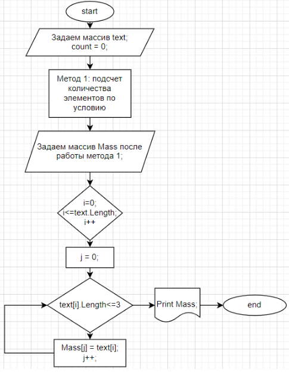

# Итоговая проверочная работа по курсу "Введение в программирование"

## Блок-схема

Блок-схема создана на https://www.draw.io/

## Работа программы
___
1. Задание начального массива (задает пользователь);
2. Написание метода, который вычисляет количество элементов в массиве, удовлетворяюшие условию;
3. Создание нового пустого массива длиною, равной количеству элементов в массиве, удовлетворяюшие условию (работа метода п.2);
4. Написание метода, который присваивает пустому массиву (п.3) те значения из изначального массива (п.1), которые удовлетворяют условию задачи;
5. Вывод искомых данных (вывод осуществляется также через метод)